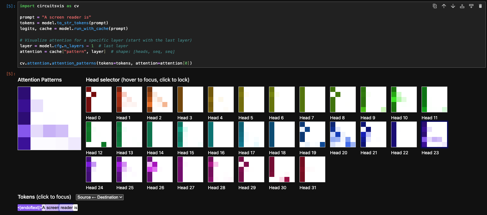

# Testing Accessibility Knowledge Across Pythia Model Sizes

While using TransformerLens to explore how different model sizes handle digital accessibility concepts, an interesting pattern began to emerge. I started with GPT-2 and noticed that it did not understand the acronym, "WCAG." Each time the question was run the model responded with something different that was either incorrect, had no meaning, or both.

This finding led to further exploration and the discovery that accessibility knowledge emerges at specific model scales. **I used the Pythia model suite and TransformerLens to map out these emergence patterns.**

## Why Pythia

Pythia is a family of models from EleutherAI trained on the same data with the same architecture, just at different sizes: 160M, 410M, 1B, 2.8B, and 6.9B parameters **(Biderman et al., 2023)**. This makes it useful for studying emergence, when you see a capability appear at a larger size, you know it's about scale, not a difference in training data.

## Setup

I used TransformerLens to load each model and run simple completion prompts. The code is minimal:

```python
from transformer_lens import HookedTransformer

model = HookedTransformer.from_pretrained("pythia-2.8b")
prompt = "A screen reader is"
output = model.generate(prompt, max_new_tokens=10, temperature=0)
```

## Declarative Knowledge: Does the Model Know Definitions?

I tested each model on accessibility concept prompts:

| Prompt                     | 160M                     | 410M                     | 1B                                   | 2.8B                            | 6.9B                                                      |
| -------------------------- | ------------------------ | ------------------------ | ------------------------------------ | ------------------------------- | --------------------------------------------------------- |
| A screen reader is         | ❌<br><br>"view a screen" | ❌<br><br>"view a screen" | ⚠️<br><br>"reads text from a screen" | ✅<br><br>"reads aloud the text" | ✅<br><br>"reads text on a computer screen"                |
| WCAG stands for            | ❌<br><br>hallucinated    | ❌<br><br>hallucinated    | ❌<br><br>hallucinated                | ❌<br><br>hallucinated           | ✅<br><br>"Web Content Accessibility Guidelines"           |
| A skip link is             | ❌<br><br>nonsense        | ❌<br><br>vague           | ❌<br><br>"data link"                 | ✅<br><br>"skip a section"       | ❌<br><br>"not displayed in browser"                       |
| The purpose of alt text is | ❌<br><br>vague           | ❌<br><br>"customize"     | ❌<br><br>"add text"                  | ✅<br><br>"brief description"    | ✅<br><br>"description of the image for visually impaired" |
| ARIA stands for            | ❌<br><br>hallucinated    | ❌<br><br>loop            | ❌<br><br>hallucinated                | ❌<br><br>hallucinated           | ❌<br><br>hallucinated                                     |
| Captions are used for      | ❌<br><br>generic         | ⚠️<br><br>"description"  | ❌<br><br>generic                     | ⚠️<br><br>"photograph"          | ❌<br><br>generic                                          |

**Findings:**

- **Screen reader, skip link, and alt text** show clear emergence at 2.8B
- **WCAG emerges at 6.9B**—the first model to correctly expand the acronym
- **ARIA never emerges**—likely too rare in training data even at 6.9B
- **Screen reader shows gradual improvement**—1B gets the mechanism ("reads text") but misses the purpose (auditory output). 2.8B nails "reads aloud."
- **Emergence isn't always monotonic**—skip link regressed from correct at 2.8B to wrong at 6.9B, suggesting capability can be unstable near emergence thresholds.

## Evaluative Knowledge: Can It Judge Code?

Knowing definitions is one thing. Can the model identify accessibility problems in code?

| Prompt                                              | 160M                | 410M               | 1B               | 2.8B                                      | 6.9B                                      |
| --------------------------------------------------- | ------------------- | ------------------ | ---------------- | ----------------------------------------- | ----------------------------------------- |
| `` is missing                  | ❌                   | ❌                  | ❌<br><br>blank   | ❌<br><br>"."                              | ❌                                         |
| A `<div>` with onclick is not accessible because    | ❌                   | ❌                  | ❌                | ❌                                         | ⚠️<br><br>"not a form control"            |
| `<input type='text'>` needs a                       | ❌<br><br>"password" | ❌<br><br>HTML soup | ❌<br><br>"value" | ❌<br><br>"value"                          | ❌<br><br>"value"                          |
| A button that only says 'Click here' is bad because | ❌                   | ❌                  | ❌                | ✅<br><br>"not clear what the button does" | ✅<br><br>"not clear what the button does" |

**Findings:**

There's a gap between declarative and evaluative knowledge. The 2.8B model can define "alt text" correctly but can't identify that an `` tag is missing one. However, it *does* correctly identify the problem with "Click here" buttons—ambiguous link text.

At 6.9B, the div/onclick answer ("not a form control") shows progress—it's recognizing something about interactivity expectations, even if the explanation isn't precise.

## Recognition vs. Generation

Perplexity measures how "surprised" a model is by text. Lower perplexity means the model finds the text more expected. I tested whether models could *recognize* correct definitions even if they couldn't generate them:

```python
correct = "A screen reader is software that reads text aloud for blind users."
wrong = "A screen reader is a device for viewing screens."
```

| Model | Correct | Wrong | Prefers |
|-------|---------|-------|---------|
| 160M | 107 | 41 | Wrong by 2.6x |
| 410M | 40 | 33 | Wrong by 1.2x |
| 1B | 19 | 42 | Correct by 2.2x |
| 2.8B | 14 | 55 | Correct by 4x |

The preference flips between 410M and 1B. But 1B's generation was still weak—it said "reads text from a screen," missing the crucial "aloud."

Recognition precedes generation. The model knows the right answer before it can produce it.

## Looking Inside: Attention Patterns

**Beyond just testing what models know, TransformerLens lets you see _how_ they represent that knowledge internally.** I looked at how the 2.8B model processes "A screen reader is."

The question: does the model treat "screen reader" as a compound term, or as two separate words?

Using circuitsvis to visualize attention patterns:

```python
import circuitsvis as cv

prompt = "A screen reader is"
tokens = model.to_str_tokens(prompt)
logits, cache = model.run_with_cache(prompt)

layer = 31  # last layer
attention = cache["pattern", layer]
cv.attention.attention_patterns(tokens=tokens, attention=attention[0])
```

**How to read this:** The visualization shows a grid where each row represents a token in the prompt. The darkness of each cell shows how much attention that token pays to previous tokens. When "reader" has a dark cell under "screen," it means the model is connecting these words together.



At layer 31, Head 23 shows "reader" attending strongly to "screen"—the model binds them as a unit rather than treating them as separate words.

This binding appears across multiple layers:

| Layer | Heads showing "reader → screen" binding |
|-------|----------------------------------------|
| 5 | 23 |
| 6 | 13 |
| 10 | 19, 27 |
| 11 | 29 |
| 12 | 10, 31 |
| 14 | 21 |
| 31 | 23 |

The concept gets reinforced through the network rather than computed once. Multiple heads at multiple layers all agree: these tokens belong together.

At 6.9B, even more heads participate in the binding, especially in early-middle layers (5, 7, 10, 11), with less activity in the final layer. The larger model does more distributed, earlier processing.

## What This Means

**For accessibility tooling:** Don't expect small models to help with accessibility. Even at 1B parameters, knowledge is partial and unreliable. The 2.8B threshold suggests you need substantial model scale before accessibility concepts are meaningfully represented—and even then, evaluative capability lags behind.

**For training data:** The WCAG and ARIA results are telling. WCAG emerges at 6.9B; ARIA never does. These are foundational accessibility acronyms, but they're rare enough in web-scale training data that emergence requires billions of parameters—or doesn't happen at all. Specialized training data or fine-tuning would likely be needed for reliable accessibility tooling.

**For evaluative tasks:** The declarative/evaluative gap suggests that even models that "know" accessibility concepts may not reliably apply them to code review. Recognition precedes generation, and generation precedes evaluation. The "Click here" success is promising, but it's one prompt out of five.

**For emergence research:** Accessibility concepts are a useful probe for studying emergence. They're concrete enough to test (unlike "reasoning"), rare enough to show scale effects (unlike "Paris is the capital of France"), and have clear right/wrong answers.

## Code

Full notebook: https://github.com/trishasalas/mech-interp-research/blob/main/pythia/pythia-a11y-emergence.ipynb

## References

Biderman, S., Schoelkopf, H., Anthony, Q., Bradley, H., O'Brien, K., Hallahan, E., ... & Belrose, N. (2023). Pythia: A suite for analyzing large language models across training and scaling. _arXiv preprint arXiv:2304.01373_.

---

*I'm an accessibility consultant exploring mechanistic interpretability. Find me on LinkedIn or Substack.*
